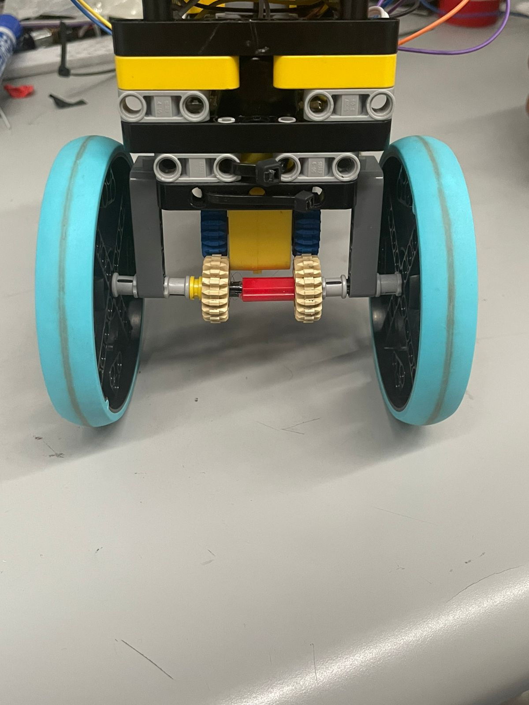
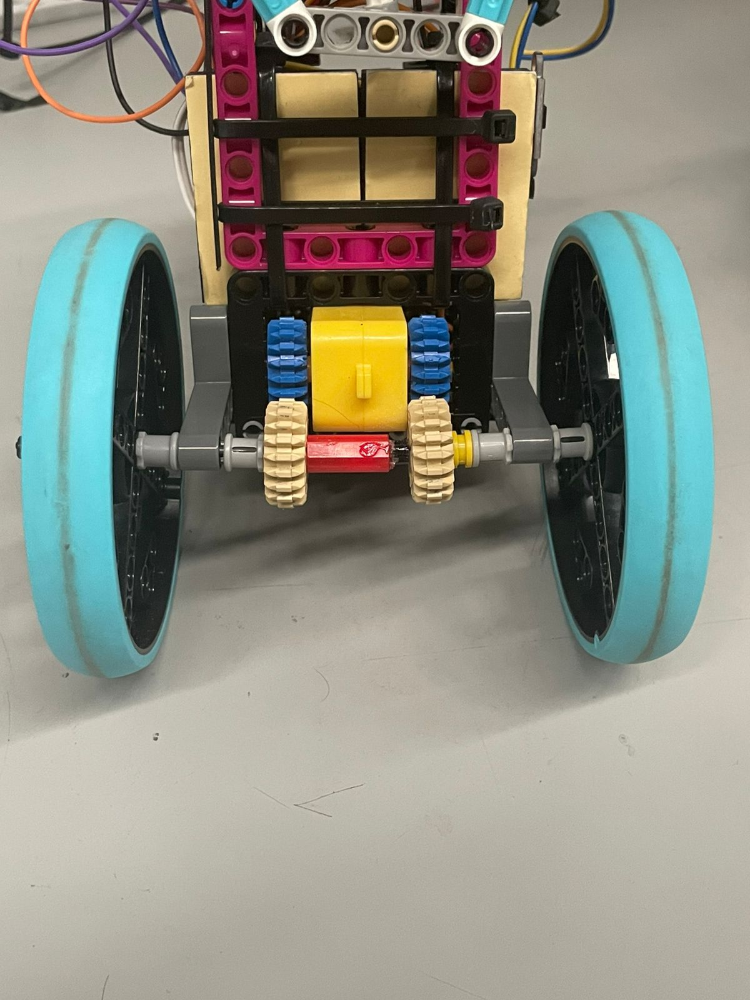
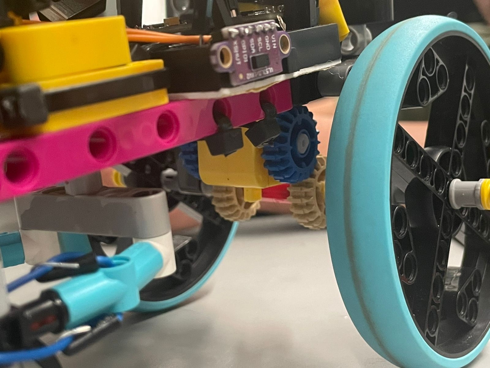

# WRO_FE_CETYS_SEAL_AV

World Robot Olympiad - Future Engineers 2026 - CETYS SEAL AV

Systems Engineering Autonomous Labs     S.E.A.L

We are a team made up of 3 first-year engineering students from Mexicali, Baja California, México, excited to participate in Future Engineers for the first time! Our robot, Seal, aims to complete the 2026 future engineers challenges, we look forward to upgrading our prototypes while sharing our journey along the way.

Read our Build-Blog !! We document every day of our journey, including our challenges and how we overcame them.      

~ Build start date: Monday April 20th, 2026

## Meet the team !!

|  |  |  |
|-----------|-----------|-----------|
| Alejandro Pineda   | Jorge Ibarra    | Yumián Rodríguez    |
| Electronic Cybernetics Engineering    | Computer Science Engineering    | Electronic Cybernetics Engineering    |
| Descript    | Descript    | Descript    |

### **📁 Documentation Evaluation Framework**

## 📊 **WRO 2025 Engineering Documentation Scoring (30 points total)**

| Scoring Area | Maximum Points | Our Documentation Coverage |
|--------------|----------------|---------------------------|
| **1. Mobility Management** | 4 points | Complete mechanical design, motor selection, steering system, assembly instructions |
| **2. Power & Sense Management** | 4 points | Power systems, sensor integration, wiring diagrams, component specifications |
| **3. Obstacle Management** | 4 points | Navigation algorithms, parking strategies, source code with detailed comments |
| **4. Pictures – Team and Vehicle** | 4 points | Multi-angle vehicle photos, team photos, component labeling |
| **5. Performance Videos** | 4 points | Complete challenge demonstrations with commentary and analysis |
| **6. GitHub Utilization** | 4 points | Version control, structured documentation, regular commits |
| **7. Engineering Factor** | 4 points | Custom design and manufacturing throughout the vehicle |
| **8. Overall Judge Impression** | 2 points | Clear communication enabling easy replication |
| **Total Documentation Score** | **30 points** | **(≈25% of total competition score)** |

## Robot Overview
S.E.A.L.   Dimensions:  cm x  cm x  cm     Weight:

| Top View | Front View | Side View | 
|-----------|-----------|-----------|
| photo    | photo    | photo
 |

## Mechanical Systems

- Rear Wheel Drive

| 
|
 
|
 

| Driven by 1 reduction motor with an approximate 60-1 reduction with lego gears. Currently using lego spike wheels for traction and large diameter. | 
|-----------|-----------|

- Servo Motor Ackerman Steering

| 
 | Driven by 1 9g servo motor that controls the angle on both our front wheels. Using an ackermnan steer lets us take advantage of the servo for tighter turns around the corners. | 
|-----------|-----------|

- Modular Double Decker Chasis

| 
 | We built our initial chasis out of lego, this allowed us to focus on the electronic and coding aspects of our build for the first few days. Lego actually ended up being a good plattform to build up from, since we had to make quick adjustments on the fly, all of this while helping us creat a modular and organized casing for our electronics. | 
|-----------|-----------|

## Electronic Systems

- Components used

| Component | Model | Quantity | Usage |
|-----------|-----------|-----------|-----------|
| photo    | Lipo Rider Plus    | 1 | Power Distribution |
| photo    | Single Cell 3.7V 1000mAh lipo battery    | 1 | Power Supply for all systems |
| photo    | ESP32    | 1 | Motor |
| photo    | ESP32 Shield    | 1 | Power Distribution |

- IMU

| Photo | asdasdasd | 
|-----------|-----------|

- H bridge

| Photo | asdasdasd | 
|-----------|-----------|

- ESP Shield

| Photo | asdasdasd | 
|-----------|-----------|

- Lipo Rider and Power Supply

| Photo | asdasdasd | 
|-----------|-----------|

- Time of Flight Sensors

| Photo | asdasdasd | 
|-----------|-----------|

## Coding and Sensors

Sensors

Actualmente contamos con 2 sensores distintos, tenemos el mpu 5060 y el vl53l0xv2 conectados en el mismo canal de I2C, el único problema es que al contar con vl53l0xv2 estos tienen la misma dirección entonces lo que se tiene que hacer es utilizar el pin XSHUT de cada sensor para asignarle una dirección distinta y poder leer ambas durante el código. **Cuidado al iniciar los sensores, tiene que estar el otro XSHUT en low al iniciar y tiene que haber un delay de aproximadamente 100ms entre la inicialización de ambos para que funcione**

C0ding

Al iniciar nuestro código empieza un ciclo de calibración donde hace 2000 lecturas de nuestra imu con el algoritmo de SensorFusion de xioTecnologies, de esta manera guardamos la media de diferencia a los 180 grados de las lecturas y lo colocamos como un offset en los 6 ejes, la aceleración en el eje x y y z y la aceleración angular en el eje x y y z.

El control es la parte más importante de este proyecto; estamos usando un sistema con doble control, cada uno independiente del otro.

Después empezamos el movimiento del motor y el control del servo. Este está dividido en dos, el 50% del error depende de la diferencia del ángulo actual al ángulo target y el otro 50% de la diferencia de la distancia de los sensores de time to flight a la pared, el target es 0 y se mide de la diferencia del doble de una lectura menos la otra, esto hace que el robot se sitúe al 33% de la pared. Esto se hace en la segunda vuelta cuando ya se sabe hacia dónde va a avanzar. En el inicio se acomoda en la mitad.

Flujo del PID

Durante el control de el robot tenemos una condicion que es girando, entocnes si la lectura de el sensor de distancia a los lados lee mas de 50 centimetros de distancia detecta como una esquina y la condicion se convierte en true, y gira hacia el lado de detecte el sensor. El giro se realiza hasta que el angulo de la lectura de la imu sea igual a +- 90. y se aguega un 1 a el contador de giros.

el codigo termina cuando el contador de giros es igual a 90.

