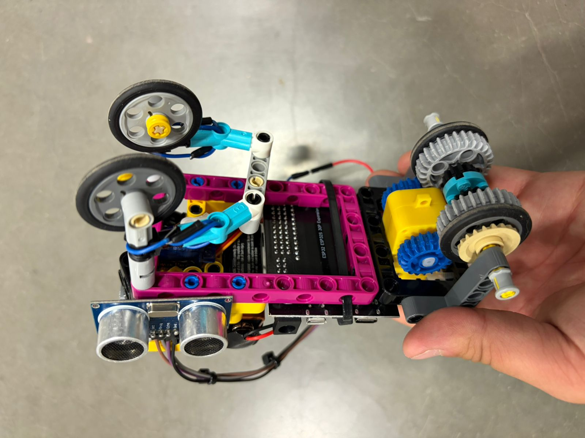
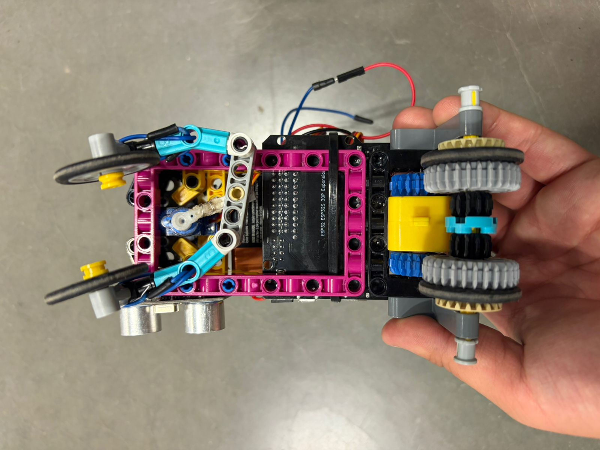
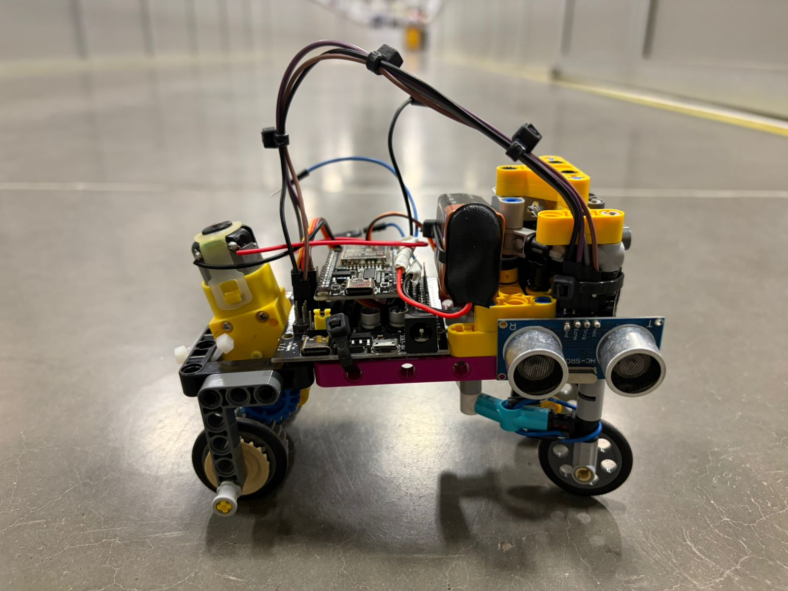

# 20 de abril de 2026

Hoy avanzamos bastante en el proyecto. Nos enfocamos en hacer pruebas de componentes y en comenzar la parte mecanica del robot.

## Lo que hicimos hoy

- Realizamos pruebas de componentes electronicos.
- Empezamos el montaje mecanico del robot.
- Probamos el puente H para validar el control de motores.
- Probamos el servo de direccion.
- Probamos la ESP32 para verificar comunicacion y funcionamiento general.
- Probamos los sensores ultrasonicos para medir distancia.
- Hicimos pruebas iniciales de control PID para deteccion de paredes y correccion de trayectoria.

## Evidencia

Vista general del robot durante pruebas:

Vista inferior:

Vista lateral:

