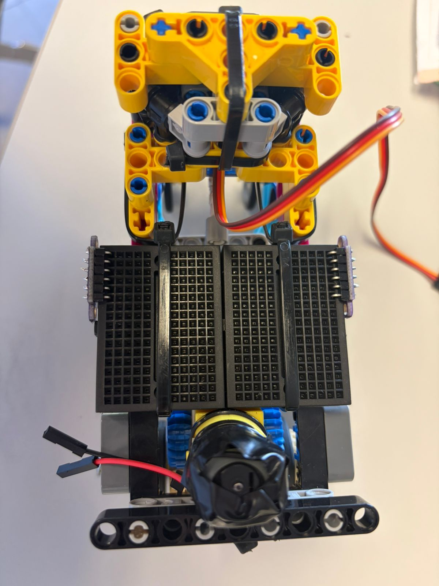
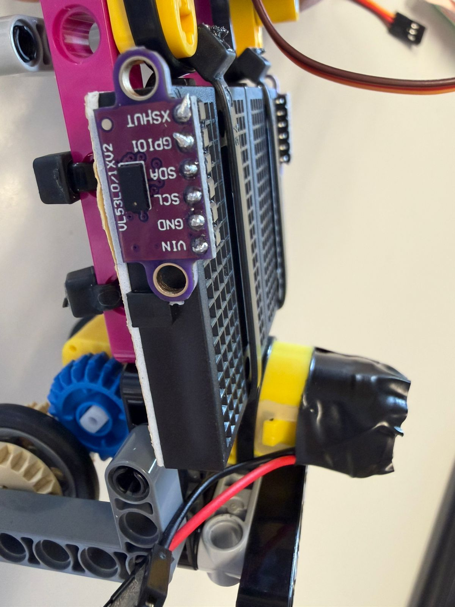

# April 21th 2026

For the second day, we focused on solving some problems we found in yesterday's tests, such as the sensing isues with the ultrasonics (that we won't be using
anymore), setting up an IMU, and finalizing our mechanical systems.

## What we did today

- Mechanical Systems
  - Secured dc and servo motor using zip-ties and lego, (zip-ties are just for keeping in place, none of the lego pieces are actually under hard stress).
  - Re did our servo to lego coupling to avoid the mechanical off-set we had.
  - We realized we didn´t need as much torque as we thought, so we reduced the reduction from approximately 90:1 to a 50:1.

- Electronic Systems
  - Changed our ultrasonic sensors for infrared Time of Flight sensors, we hope to increase our range and obtain better readings.
  - Re did our flooring for our robot, now it's a protoboard floor where we mounted our sensors, this will help with keeping our desing enclosed and save space in the future.
  - Started setup for our IMU, we did off-robot tests and are still working on the filter for the data we need.

## Day 2 evidence

ProtoFloor:

ToF Sensor:

