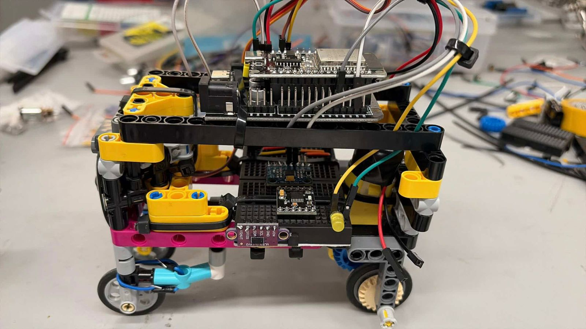

# April 22nd 2026

It's wednesday now, we are officialy halfway done with our robot in 5  days journey. As for today, we finished calibration of our imu, and implemented it to help our robot mantain orientation while traversing the challenge. We worked more on our electronical organization as well, adding our h bridge and wiring it all together. We're currently facing am issue in which we can't use our dc motor and the servo at the same time, we believe it's because of insufficient current. Tomorrow we will not be able to work on the prototype due to school related activities, but we look forward for our last stretch this friday/saturdauy.

## What we did today

- Electronic Systems
  - Implemented our IMU alongside our time of flight sensor.
  - Took advantage of protoboard floor to connect everything close together.
  - H bridge setup completed, we know it's working correctly because we are able to control the dc motor, it's only when we tried moving the servo that the motor stalls. We were honestly kinda puzzled at this, we tried different approaches to overcome this problem, sucha as changing our wiring, our code, stop using the esp32's power supply, even brought up a capacitor. At the end, we decided to try implementing a current booster, which we will try on friday.

- Coding ! !
  - Began our first all-inclusive code, which connected the servo, IMU, and sensor, to mantain the orientation of our robot.
  - Wrote the algorythm to keep the robot a certain distance away from the wall. Thanks to our PID we were able to tune it on the fly pretty easily, this helped setting up initial test values.

## Day 3 Evidence

Double Decker:

